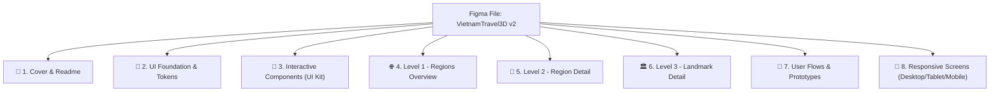
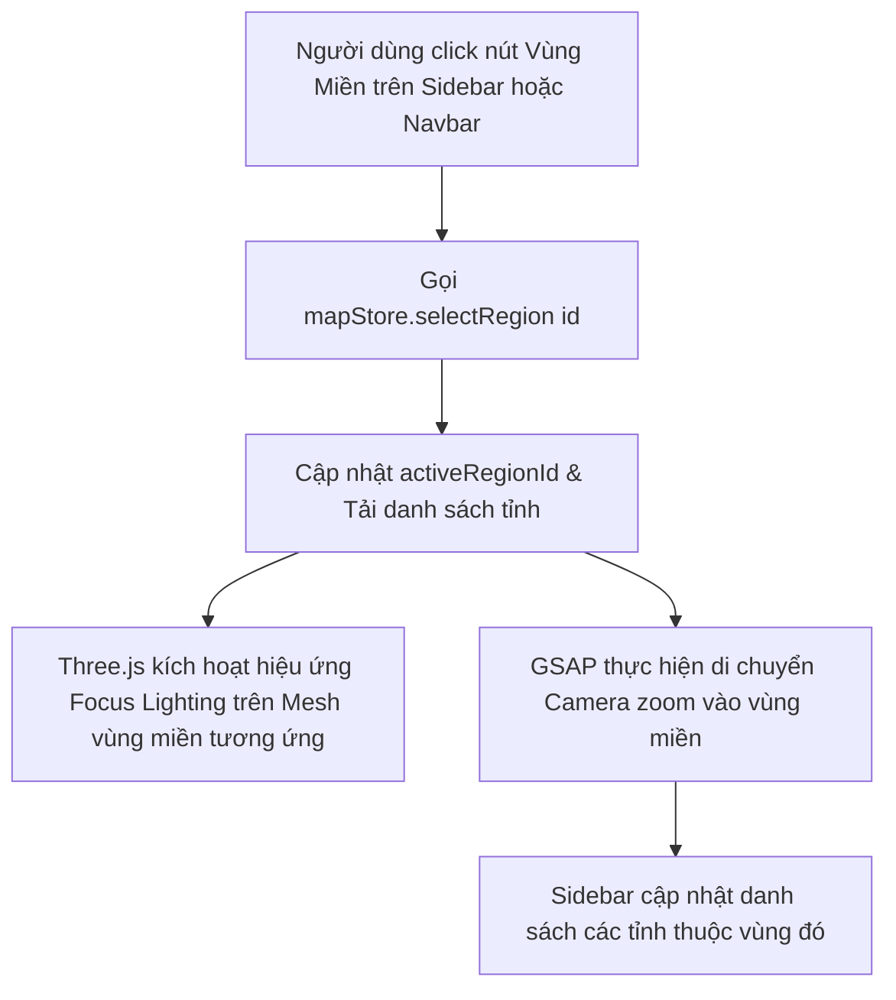
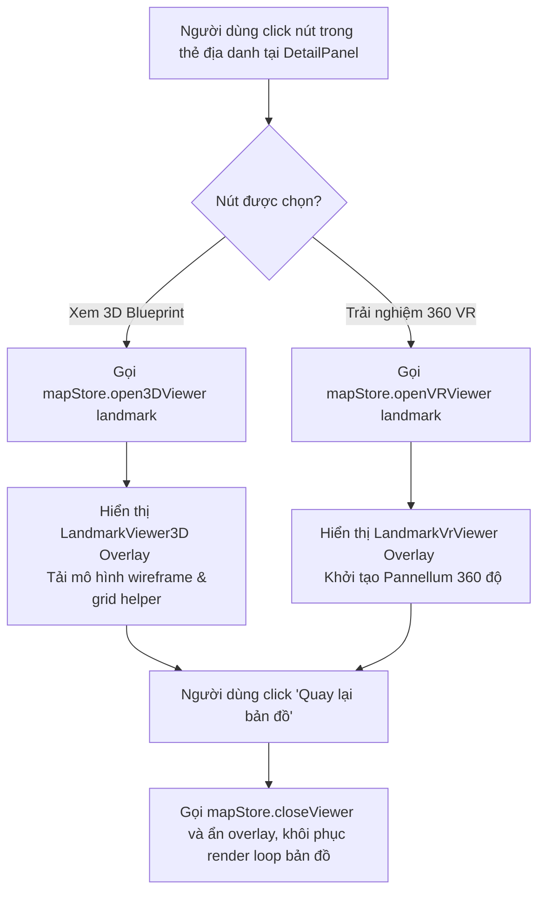
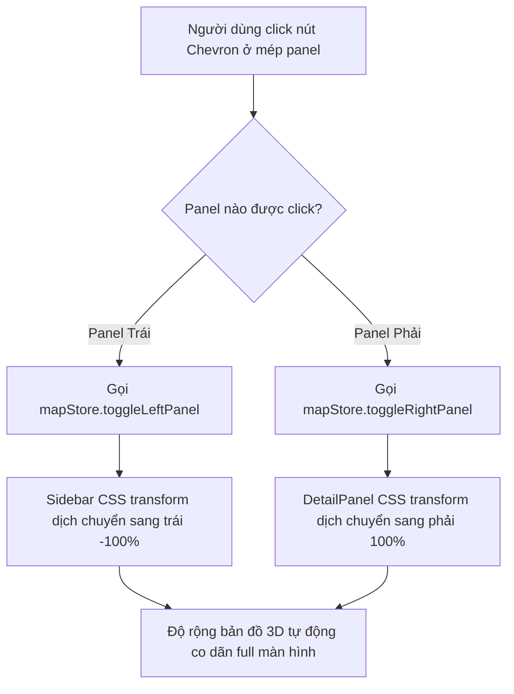

# 📑 Tài Liệu Đặc Tả Cấu Trúc Figma & Trải Nghiệm Người Dùng: VietnamTravel3D (ĐÃ LƯỢC BỎ / OMITTED)

> [!WARNING]
> **TÀI LIỆU ĐÃ ĐƯỢC LƯỢC BỎ (OMITTED / ARCHIVED)**
> Theo quyết định mới nhất từ khách hàng vào ngày 05/06/2026, yêu cầu xây dựng thiết kế Figma cho dự án VietnamTravel3D đã được chính thức loại bỏ khỏi phạm vi dự án để tập trung tài nguyên vào hoàn thiện mã nguồn và triển khai vận hành thực tế. Tài liệu này được lưu trữ lại chỉ nhằm mục đích tham khảo lịch sử phát triển và sẽ không được sử dụng để thiết kế hoặc nghiệm thu.

> **Phát hành bởi:** Project Manager AI  
> **Phiên bản:** v2.0-Figma-Spec (Archived)  
> **Ngày cập nhật:** 05/06/2026  
> **Trạng thái:** Đã lược bỏ (Omitted)  
> **Đối tượng bàn giao:** UI/UX Designer & Phát triển Frontend  

---

## 🗺️ 1. Kế Hoạch Cấu Trúc Các Trang Trong Figma (Figma Pages Structure)

Để đảm bảo tệp Figma được quản lý khoa học, dễ hiểu đối với cả Designer và Developer, cấu trúc tệp Figma được phân chia thành các trang (Pages) như sau:

### 📌 Trang 1: Cover & Readme
*   **Cover Thumbnail**: Ảnh bìa dự án với phối màu tối + ánh kim sang trọng, tên dự án "VietnamTravel3D" và tag phiên bản `v2.0-SPEC`.
*   **Project Info**: Tóm tắt mục tiêu dự án, người thực hiện, lịch sử thay đổi (Changelog) và liên kết đến tài liệu kỹ thuật/mã nguồn.
*   **Figma File Guidelines**: Quy tắc đặt tên layer, sử dụng Auto Layout và cách dùng component instance.

### 🎨 Trang 2: UI Foundation & Tokens (Hệ Thống Nền Tảng)
*   **Color Palette (Hệ màu chủ đạo)**:
    *   *Nền tối*: Base `#0D0D0D`, Card/Panel background `#1A1A1A` (áp dụng opacity khác nhau).
    *   *Màu thương hiệu*: Vàng Gold (`#D4AF37` / `#FFDF00`), Xanh ngọc Emerald (`#097969` / `#50C878`), Neon Blue (`#00FFFF` / `#00A3E0`).
*   **Typography**: Định nghĩa các text styles (Inter hoặc Roboto Mono làm font bổ trợ cho tọa độ). Thiết lập size, weight, line-height cho H1, H2, Body, Caption, Monospace.
*   **Grid & Spacing System**: Hệ lưới 12-column cho UI overlay, quy chuẩn khoảng cách 4px, 8px, 12px, 16px, 24px, 32px.
*   **Shadows & Blurs**: Hiệu ứng kính mờ (Glassmorphism token):
    *   `backdrop-filter: blur(16px)`
    *   `background: rgba(26, 26, 26, 0.45) / rgba(26, 26, 26, 0.85)`
    *   `border: 1px solid rgba(255, 255, 255, 0.08)`

### 🧱 Trang 3: Interactive Components - UI Kit (Các Component Tương Tác)
*   **Buttons**: Normal, Hover, Active, Disabled cho các biến thể (Primary Gold, Secondary Emerald, Outline, Icon Button).
*   **Map Pins (Ghim bản đồ)**:
    *   *Ghim Thường* (Trắng)
    *   *Ghim Vùng đặc biệt/TP Trung ương* (Vàng Gold)
    *   *Ghim Active/Selected* (Xanh ngọc Cyan kèm vòng tròn pulsing ring phát sáng).
*   **Sidebar & Cards**: Panel Trái (Sidebar) và Panel Phải (DetailPanel) với các nút Chevron đóng/mở.
*   **Navigation & Tabs**: Các nút chọn vùng miền (Toàn quốc, Bắc Bộ, Trung Bộ, Nam Bộ, Biển Đảo).
*   **Trình xem VR & 3D**: Bộ điều khiển zoom, compass (la bàn), thanh chọn góc chụp (Angle Selector).

### 🌐 Trang 4: Level 1 - Regions Overview (Tổng Quan Bản Đồ Toàn Quốc)
*   Hiển thị bản đồ 3D Việt Nam phát sáng dạng Hologram/Blueprint (Wireframe màu Cyan).
*   Đầy đủ hệ thống biển đảo dọc bờ biển và hai quần đảo **Hoàng Sa - Trường Sa** được ghim màu vàng Gold phát sáng rực rỡ.
*   Navbar hiển thị logo VN, Sidebar hiển thị danh sách các tỉnh thành mặc định, DetailPanel đóng.

### 📍 Trang 5: Level 2 - Region Detail (Chi Tiết Từng Vùng Miền)
*   Thiết kế giao diện cho 4 trạng thái vùng miền:
    1.  *Bắc Bộ*: Chỉ có Bắc Bộ phát sáng, có ghim vàng Gold tại Hà Nội và Hải Phòng.
    2.  *Trung Bộ*: Chỉ có Trung Bộ phát sáng, có ghim vàng Gold tại Đà Nẵng.
    3.  *Nam Bộ*: Chỉ có Nam Bộ phát sáng, có ghim vàng Gold tại TP. Hồ Chí Minh và Cần Thơ.
    4.  *Biển Đảo*: Đất liền tối đi hoàn toàn, toàn bộ các đảo ven bờ và hai quần đảo Hoàng Sa - Trường Sa phát sáng rực rỡ.
*   Sidebar hiển thị danh sách tỉnh của riêng vùng miền được chọn.

### 🏛️ Trang 6: Level 3 - Landmark Detail (Chi Tiết Địa Danh)
*   **Chế độ Mô hình 3D (3D Blueprint Mode)**: Canvas tối đen, hiển thị mô hình lưới 3D kỹ thuật số (màu Neon Cyan hoặc Gold) đặt trên một lưới đo đạc (Grid Helper) màu vàng Gold. Có la bàn chỉ hướng và hướng dẫn xoay/zoom.
*   **Chế độ Trải nghiệm VR 360 (VR Panorama Mode)**: Ảnh chụp panorama 360 độ hiển thị toàn màn hình, thanh chọn góc chụp (Angle Selector) ở dưới, có la bàn xoay và thanh zoom.

### 🔄 Trang 7: User Flows & Prototypes (Luồng Tương Tác)
*   Bản thiết kế luồng tương tác hoàn chỉnh từ việc lọc vùng -> chọn tỉnh -> zoom camera -> mở detail -> xem 3D/VR.

### 📱 Trang 8: Responsive Screens (Thích Ứng Thiết Bị)
*   Thiết kế giao diện trên Desktop (1440px), Tablet (1024px) và Mobile (375px), đặc biệt là cách xử lý thu gọn panel trên màn hình nhỏ.

---

## 🔄 2. Các Luồng Tương Tác Chính (User Flows)

Dưới đây là các sơ đồ luồng chi tiết được xây dựng dựa trên hoạt động của `mapStore.ts` và các file components.

### Luồng 1: Lọc Vùng Miền & Điều Hướng Camera Bản Đồ

### Luồng 3: Trải Nghiệm Chi Tiết Địa Danh (3D Blueprint & VR 360)

### Luồng 4: Thu Gọn / Mở Rộng Panel Tối Giản (Minimalist UI)

---

## 🎛️ 3. Các Biến Thể Trạng Thái Của Component (Component States)

Designer cần thiết kế đầy đủ các biến thể trạng thái trong Figma Component Set để Developer áp dụng chính xác mã CSS.

### 3.1. Các Map Pins (Ghim Bản Đồ 3D)
> [!IMPORTANT]
> Toàn bộ các ghim phải có thiết kế dạng 3D khối phát sáng nhẹ, màu sắc thể hiện rõ vai trò hành chính và chủ quyền biển đảo.

| Biến thể trạng thái | Màu sắc chủ đạo | Hiệu ứng đi kèm | Mô tả sử dụng |
| :--- | :--- | :--- | :--- |
| **Normal Pin** | Trắng (`#FFFFFF`) | Border mờ 10% | Pin hiển thị các tỉnh thành thông thường. |
| **Central / Island Pin** | Vàng Gold (`#D4AF37`) | Pulsing Ring vàng bên dưới phát sáng | Ghim các thành phố trực thuộc TW (Hà Nội, Hải Phòng, Đà Nẵng, TP.HCM, Cần Thơ) & các đảo, quần đảo (Hoàng Sa, Trường Sa, Phú Quốc...). |
| **Selected Pin** | Xanh ngọc Cyan (`#00FFFF`) | Pulsing Ring Cyan rippling mạnh, bóng đổ neon | Trạng thái tỉnh đang được người dùng lựa chọn để xem chi tiết. |

### 3.2. Sidebar (Panel Trái) & DetailPanel (Panel Phải)
*   **Trạng thái Mở rộng (Expanded)**: 
    *   Chiều rộng: Sidebar (320px), DetailPanel (384px).
    *   Nền: Glassmorphism (`rgba(26, 26, 26, 0.85)` cho Panel Phải để đọc chữ tốt hơn, `rgba(26, 26, 26, 0.45)` cho Sidebar).
    *   Nút chevron hướng vào trong panel (`<` hoặc `>`).
*   **Trạng thái Thu gọn (Collapsed)**:
    *   Panel trượt khuất khỏi màn hình (sử dụng `transform: translateX`).
    *   Chỉ còn nút Chevron nổi mép màn hình bám dọc ở giữa chiều cao màn hình để người dùng click mở lại.
*   **Trạng thái Tải dữ liệu (Loading/Skeleton)**:
    *   Hiển thị hiệu ứng shimmer mờ đối với danh sách tỉnh hoặc danh sách địa danh khi API đang được tải.

### 3.3. Các Nút Bấm & Bộ Chọn (Buttons & Selectors)
*   **Vùng Miền Selector Tabs**:
    *   *Active State*: Chữ trắng, viền dưới màu xanh ngọc Emerald `#50C878` dày 2px, nền button tối mờ.
    *   *Inactive State*: Chữ trắng mờ 50%, không viền, hover đổi màu chữ lên 80%.
*   **Thẻ Địa Danh (Landmark Card)**:
    *   *Normal*: Viền mờ `white/5`, ảnh phong cảnh nguyên bản.
    *   *Hover*: Viền đổi sang xanh ngọc `emerald/30`, ảnh zoom nhẹ 105% (hiệu ứng phóng đại mượt), tiêu đề đổi màu sang vàng Gold.
*   **Nút Xem 3D Blueprint & Xem VR 360**:
    *   *Normal*: Nút 3D màu vàng Gold/màu xanh ngọc Emerald phẳng, chữ đậm.
    *   *Hover*: Ánh sáng gradient tăng cường độ sáng 10%, bóng đổ phát sáng màu tương ứng lan tỏa nhẹ.
    *   *Active (Click)*: Scale nhỏ đi 98% tạo cảm giác nhấn nút vật lý.

---

## 📋 4. Danh Sách Kiểm Tra Nghiệm Thu Thiết Kế (Design Validation Checklist)

Đây là bảng kiểm tra bắt buộc mà Designer phải tự rà soát trước khi xuất bản bản thiết kế chính thức cho đội ngũ kỹ thuật.

### 🗺️ A. Tính Đúng Đắn Địa Lý & Chủ Quyền Quốc Gia (Bắt buộc 100%)
- [ ] **Sự hiện diện của Hoàng Sa & Trường Sa**: Cả hai quần đảo Hoàng Sa và Trường Sa phải được vẽ rõ ràng trên bản đồ cấp độ 1, cấp độ 2 (Biển đảo) và có ghim màu vàng Gold phát sáng cố định.
- [ ] **Ghim các Đảo ven bờ**: Các đảo như Phú Quốc, Côn Đảo, Cát Bà, Lý Sơn phải được hiển thị bằng cụm điểm vàng hoặc ghim vàng tương ứng trên bản đồ.
- [ ] **Tính chính xác của 5 Thành phố trực thuộc Trung ương**: 5 thành phố này (Hà Nội, Hải Phòng, Đà Nẵng, TP. Hồ Chí Minh, Cần Thơ) bắt buộc phải có ghim màu vàng Gold đặc biệt (chứ không phải ghim trắng).

### 🎨 B. Tính Nhất Quán Về Visual & UI Tokens
- [ ] **Hệ màu chuẩn**: Tất cả màu tối, vàng Gold, xanh ngọc, xanh neon blue phải khớp chính xác mã HEX/HSL như định nghĩa trong thiết kế v2.
- [ ] **CSS Glassmorphism**: Kiểm tra xem các panel 2D đã được áp dụng hiệu ứng kính mờ (blur + opacity + viền trắng mờ) chưa. Các layer dưới kính mờ không bị lem hoặc vỡ hình.
- [ ] **Typography**: Không dùng quá 2 font family khác nhau trong dự án. Tất cả kích cỡ chữ, khoảng cách dòng phải được chuyển đổi thành Figma Text Styles.

### 🔄 C. Trải Nghiệm Tương Tác & Responsive
- [ ] **Độ thích ứng (Responsive)**: Có đầy đủ layout cho 3 màn hình Desktop, Tablet, Mobile.
- [ ] **Tương tác khi thu gọn panel**: Trên mobile, khi DetailPanel mở ra, Sidebar trái phải tự động ẩn đi và ngược lại để không đè chồng chéo UI.
- [ ] **Trạng thái Trống/Lỗi (Empty & Error States)**: Có thiết kế cho trường hợp không tải được danh sách tỉnh, hoặc khi tỉnh đó chưa có địa danh nào được cập nhật.
- [ ] **Trình xem VR & 3D**: Trình xem VR có thanh chọn góc (Angle Selector) nằm cân đối ở dưới và la bàn định vị rõ ràng. Trình xem 3D hiển thị dạng wireframe trong suốt trên mặt lưới.

---

## 🛠️ 5. Hướng Dẫn Bàn Giao Thiết Kế (Handover Instructions)

Để quá trình lập trình diễn ra suôn sẻ, Designer vui lòng chuẩn bị:
1. **Figma Dev Mode Ready**: Đảm bảo tất cả các component đều đã được dọn dẹp layer rác, đặt tên tiếng Anh có nghĩa theo quy tắc BEM (ví dụ: `sidebar__button--active`).
2. **Export Asset**: Đóng gói các icon SVG, logo VN và các ảnh mockup phong cảnh gốc của các địa danh lên thư mục tài nguyên dùng chung.
3. **Prototype Link**: Gửi kèm liên kết chạy thử luồng tương tác (Prototype Link) đã liên kết các màn hình chuyển tiếp mượt mà.
