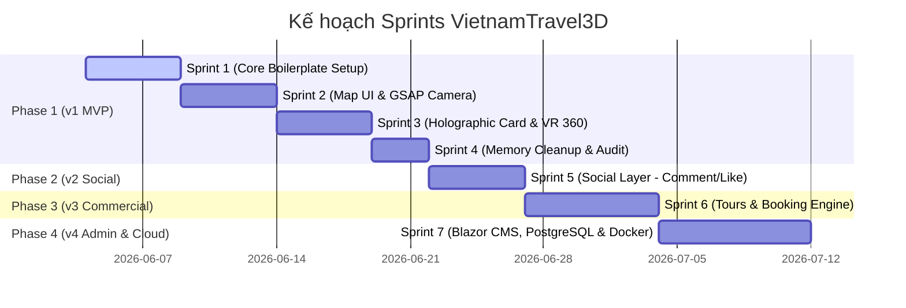

# 🚀 Biên Bản Đồng Thuận Dự Án (Project Kick-off Charter)
## Dự án: VietnamTravel3D

Tài liệu này đóng băng (freeze) 4 trụ cột cốt lõi của dự án làm nền tảng trước khi bắt đầu lập trình: Nhân sự, Quy trình phát triển, Quy trình quản lý và Kế hoạch Sprint.

---

## 👥 1. Chốt Cơ Cấu Nhân Sự (Staffing Alignment)

Dự án áp dụng mô hình phối hợp **Solo Developer & Dàn Trợ lý AI (Multi-Agent)**:

*   **Bạn (Lead Developer & Product Owner)**: 
    *   Trực tiếp lập trình chính (Backend C# & Frontend Nuxt 3).
    *   Ký duyệt yêu cầu (Spec) và nghiệm thu kết quả.
*   **`Antigravity` (Software Architect & Coordinator)**: Điều phối chung, tư vấn thiết kế hệ thống vĩ mô.
*   **`ba_agent` (Business Analyst)**: Viết tài liệu đặc tả (Spec), mô tả yêu cầu nghiệp vụ và các trường hợp biên.
*   **`pm_agent` (Project Manager)**: Duy trì danh sách task trong `task.md`, giám sát scope.
*   **`qa_tester` (QA/Tester)**: Viết kịch bản kiểm thử, review mã nguồn và đề xuất bộ test.
*   **`be_assistant` (Trợ lý Backend)** & **`fe_assistant` (Trợ lý Frontend)**: Cung cấp code snippet mẫu, hỗ trợ sửa lỗi biên dịch và rà soát memory leak.

---

## 🔄 2. Chốt Quy Trình Phát Triển (Development Workflow)

Áp dụng phương pháp **Spec-Driven Development (SDD)** với chu kỳ lặp 5 bước:

```
[BƯỚC 1: ĐẶC TẢ (BA)] ➔ [BƯỚC 2: PHÂN RÃ TASK (PM)] ➔ [BƯỚC 3: LẬP TRÌNH (Bạn + Trợ lý)] ➔ [BƯỚC 4: KIỂM THỬ (Tester)] ➔ [BƯỚC 5: TỔNG KẾT (SA)]
```

*   **Ràng buộc Spec-First**: Không code khi chưa thống nhất cấu trúc dữ liệu JSON API và Schema Database.
*   **Chế độ cộng tác**: **Chế độ 1: Học tập chuyên sâu (Learning Mode)**. Trợ lý chỉ gợi ý code snippet giải thích bản chất để bạn tự tay lập trình, Tester cung cấp kịch bản kiểm thử bằng chữ để bạn tự code kiểm thử.

---

## 📊 3. Chốt Quy Trình Quản Lý (Project Management)

Dự án vận hành theo mô hình **Scrum Tinh Gọn (Lightweight Scrum)**:

*   **Công cụ theo dõi**: Duy trì bảng công việc tại tệp [task.md](file:///C:/Users/tranv/.gemini/antigravity/brain/774656cf-a52d-47b8-af38-3c8171037dca/task.md).
*   **Kiểm soát Scope v1 MVP**:
    *   *In-scope*: Bản đồ 3D Blueprint ➔ Zoom tỉnh/miền ➔ Thẻ ảnh lơ lửng ➔ Xem VR 360 Panorama qua popup 2D ➔ Đếm lượt xem (Fullstack API SQLite).
    *   *Out-of-scope*: Đăng nhập (Auth), Đặt phòng/Homestay, Thanh toán, Admin CMS. Các tính năng này bị cấm phát triển ở Phase 1.

---

## 📅 4. Kế Hoạch Sprint Chi Tiết (Sprints Roadmap)

Để kiểm soát rủi ro và ra mắt sản phẩm đều đặn, lộ trình phát triển được chia làm **7 Sprints chính**:



### 📍 Sprint 1: Khởi tạo Boilerplate & SQLite (Core Setup)
*   **Mục tiêu**: Có môi trường chạy thử cục bộ hoàn chỉnh cho cả Frontend và Backend.
*   **Nhiệm vụ chính**:
    *   Khởi tạo dự án Nuxt 3 với TS, Tailwind CSS, TresJS, GSAP.
    *   Khởi tạo dự án Web API ASP.NET Core theo cấu trúc Clean Architecture 4 lớp.
    *   Tạo DB SQLite, thiết lập thực thể EF Core và seed dữ liệu 3 miền mẫu.
*   **Đầu ra**: Frontend gọi API lấy được danh sách Vùng/Miền mẫu hiển thị dưới dạng JSON thô trên giao diện.

### 📍 Sprint 2: WebGL Canvas & GSAP Camera Transition (Map UI)
*   **Mục tiêu**: Hoàn thành trải nghiệm bản đồ 3D tương tác cấp tỉnh/miền.
*   **Nhiệm vụ chính**:
    *   Tải mô hình bản đồ 3D placeholder (GLB/Draco nén) lên canvas TresJS.
    *   Viết logic bắt sự kiện click chuột trên Mesh bản đồ.
    *   Sử dụng GSAP di chuyển camera mượt mà đến góc nhìn zoom cận cảnh của từng miền/tỉnh được chọn.
*   **Đầu ra**: Zoom mượt mà và hiển thị thông tin 2D bên cạnh khi click vào bản đồ.

### 📍 Sprint 3: Thẻ Ảnh Lơ Lửng & VR 360 Panorama (Core Interaction)
*   **Mục tiêu**: Hoàn thiện toàn bộ luồng nghiệp vụ của v1 MVP.
*   **Nhiệm vụ chính**:
    *   Dựng các Plane Mesh (Thẻ ảnh lập thể) bay lơ lửng xung quanh khu vực bản đồ 3D khi chọn tỉnh.
    *   Click vào thẻ ảnh mở popup 2D tích hợp thư viện **Pannellum** hiển thị ảnh VR 360 Panorama.
    *   Gọi API `POST /api/landmarks/{id}/view` tự động tăng số lượt xem của địa danh.
*   **Đầu ra**: Trải nghiệm xem ảnh VR 360 và đếm view hoạt động fullstack.

### 📍 Sprint 4: Giải Phóng Bộ Nhớ GPU & Nghiệm Thu v1 (Audit & Polish)
*   **Mục tiêu**: Tối ưu hóa hiệu năng, đảm bảo chạy mượt mà, không crash trên thiết bị di động.
*   **Nhiệm vụ chính**:
    *   Viết đệ quy hàm hủy tài nguyên GPU (`geometry.dispose()`, `material.dispose()`, `texture.dispose()`) tại hook `onUnmounted`.
    *   Nén lại toàn bộ ảnh cấu trúc sang định dạng WebP.
    *   Chạy test kiểm tra rò rỉ bộ nhớ (Chrome Memory Profiler).
*   **Đầu ra**: Đóng gói phiên bản v1 MVP mượt mà, không leak RAM GPU.

### 📍 Sprint 5 (v2): Thêm Tương Tác Xã Hội (Social Layer)
*   *Nhiệm vụ chính*: Tính năng viết bình luận ẩn danh (có rate-limiting chống spam), nút thả tim/like địa danh, bộ tìm kiếm địa danh bằng thanh search 2D.

### 📍 Sprint 6 (v3): Tích Hợp Đặt Vé & Thanh Toán (Booking Engine)
*   *Nhiệm vụ chính*: Hiển thị homestay/tour guide, giỏ đặt phòng, tích hợp cổng thanh toán VNPay Sandbox, triển khai JWT Auth để lưu lịch sử đặt chỗ.

### 📍 Sprint 7 (v4): Quản Trị & Đóng Gói Docker (Deployment)
*   *Nhiệm vụ chính*: Xây dựng trang admin bằng Blazor Server, đổi DB sang PostgreSQL, đóng gói Docker Compose và deploy CI/CD lên VPS.

### 📐 4.1. Phân Bổ Thiết Kế DB & Design Patterns Theo Sprints

Để kiểm soát độ phức tạp kỹ thuật và đảm bảo tính học tập bền vững, thiết kế DB và các Design Patterns được phân bổ như sau:

| Thành Phần | Sprint Thực Hiện | Chi Tiết Áp Dụng |
| :--- | :--- | :--- |
| **Thiết Kế DB SQLite v1** | **Sprint 1** | Định nghĩa các thực thể Domain (`Region`, `Province`, `Landmark`, `LandmarkImage`) và mối quan hệ 1-N thông qua EF Core Fluent API. |
| **Thiết Kế DB v2 (Social)** | **Sprint 5** | Thêm bảng `Comment` để lưu bình luận ẩn danh và trường `LikeCount` / `ViewCount` tương tác. |
| **Thiết Kế DB v3 (Booking)** | **Sprint 6** | Thêm các bảng `User`, `Booking`, `Payment` để xây dựng luồng giao dịch. |
| **Thiết Kế DB v4 (Enterprise)**| **Sprint 7** | Di chuyển hoàn toàn SQLite sang PostgreSQL thông qua việc cấu hình lại Connection String và EF Core Provider. |
| **Clean Architecture Pattern** | **Sprint 1** | Phân chia cấu trúc Solution thành 4 Layer tách biệt, kiểm soát hướng phụ thuộc (Domain ở trung tâm). |
| **Repository Pattern** | **Sprint 1** | Viết các Repository interfaces tại `Application` và triển khai cụ thể tại `Infrastructure` để che giấu EF Core. |
| **Global Exception Pattern** | **Sprint 1** | Sử dụng Middleware (Chain of Responsibility) để bắt lỗi tập trung tại Presentation layer và chuẩn hóa định dạng JSON lỗi. |
| **Dependency Injection** | **Sprint 1 - 7** | Đăng ký lỏng lẻo các Services và DbContext trong tệp `Program.cs`. |

---


## 🚦 5. Ký Xác Nhận Khởi Động

Biên bản đã được ký đóng băng bởi toàn bộ dàn AI Agents. Hãy gửi xác nhận của bạn để chính thức bắt đầu dự án!
