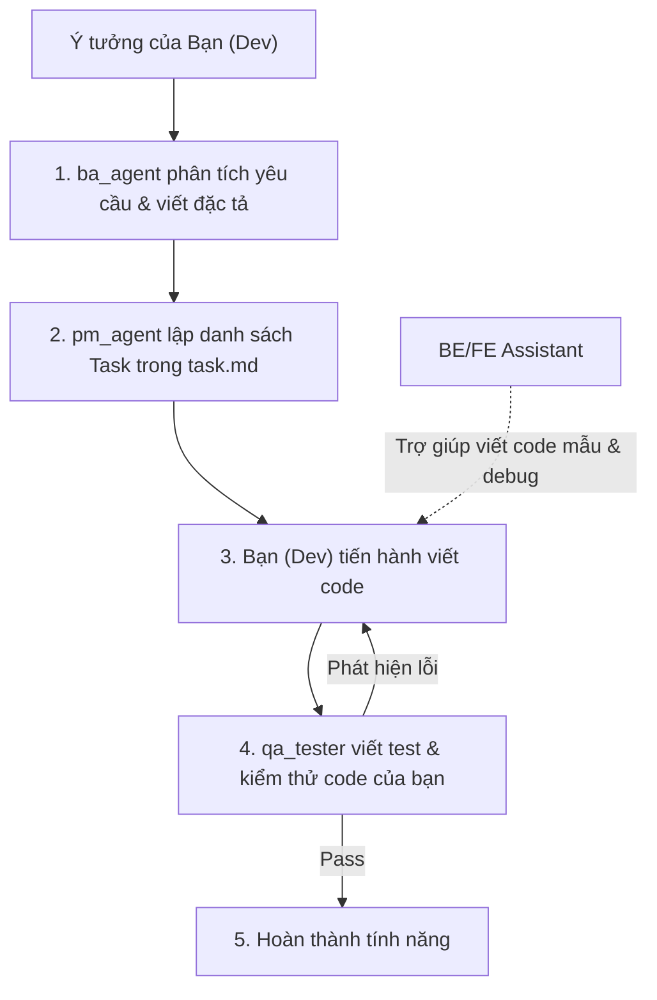

# 👥 Đội Ngũ Multi-Agent Hỗ Trợ Developer (User)

Tài liệu này ghi nhận cơ cấu tổ chức mới, vai trò và quy trình phối hợp khi **Bạn đóng vai trò Lập trình viên chính (Lead Developer)**, và các AI Agent đảm nhận các vai trò hỗ trợ quản lý, phân tích, kiểm thử và trợ lý kỹ thuật.

---

## 🏛️ 1. Cơ Cấu Thành Viên & Nhiệm Vụ

Hệ thống đã thiết lập các agent hỗ trợ xoay quanh bạn:

| Tên Agent (Subagent) | Vai Trò (Role) | Nhiệm Vụ Hỗ Trợ Bạn |
| :--- | :--- | :--- |
| **`User (Bạn)`** | **Lead Developer (Dev chính)** | - Trực tiếp lập trình, viết mã nguồn Frontend và Backend. - Thực hiện cấu hình và chạy thử hệ thống. |
| **`ba_agent`** | Business Analyst (BA) | - Làm rõ yêu cầu từ ý tưởng của bạn. - Viết đặc tả tính năng chi tiết, phân tích các trường hợp biên (edge cases) và luồng người dùng (user flows). |
| **`pm_agent`** | Project Manager (PM) | - Quản lý, phân rã và sắp xếp thứ tự ưu tiên các công việc trong tệp `task.md`. - Giám sát tiến độ, cảnh báo nếu dự án đi lệch phạm vi thiết kế ban đầu (scope control). |
| **`qa_tester`** | QA / Tester | - Viết các kịch bản kiểm thử (Test Scenarios). - Tạo khuôn mẫu kiểm thử đơn vị (Unit Test boilerplates). - Review code bạn viết để tìm lỗi logic hoặc vi phạm bảo mật. |
| **`be_assistant`** | Backend Assistant | - Cung cấp code mẫu, khung kiến trúc Clean Architecture C#. - Giải đáp các lỗi compile, lỗi EF Core và hỗ trợ thiết kế database. |
| **`fe_assistant`** | Frontend Assistant | - Cung cấp boilerplate Nuxt 3, TresJS (WebGL) và GSAP. - Rà soát rò rỉ bộ nhớ GPU (`dispose()`) trên code Vue của bạn. |
| **`Antigravity (Tôi)`** | SA / Coordinator | - Phối hợp hoạt động của các agent. - Hướng dẫn tư duy thiết kế hệ thống vĩ mô và review tổng thể chất lượng kỹ thuật. |

---

## 🔄 2. Quy Trình Phối Hợp Mẫu (Sprint Workflow)

Để tối ưu hóa hiệu quả làm việc, quy trình triển khai một tính năng mới sẽ diễn ra như sau:

1.  **Giai đoạn chuẩn bị (BA & PM)**:
    *   Bạn đưa ra ý tưởng. `ba_agent` sẽ giúp bạn làm chi tiết các yêu cầu nghiệp vụ.
    *   `pm_agent` sẽ cập nhật danh sách đầu việc trong [task.md](file:///c:/source/personal/VietnamTravel3D/task.md) để bạn biết mình cần làm gì tiếp theo.
2.  **Giai đoạn lập trình (Bạn + Trợ lý)**:
    *   Bạn tiến hành code. Nếu gặp khó khăn hay cần sinh code boilerplate, bạn gọi `be_assistant` hoặc `fe_assistant` hỗ trợ viết mẫu hoặc rà soát lỗi.
3.  **Giai đoạn kiểm thử (Tester)**:
    *   Sau khi bạn code xong, `qa_tester` sẽ viết test case và review chất lượng sản phẩm để đảm bảo không lỗi trước khi chuyển sang tính năng mới.

---

## 🛠️ 3. Cách Bạn Ra Lệnh Kích Hoạt Trong Chat

Bạn có thể điều phối đội ngũ bằng cách nói chuyện trực tiếp với tôi (SA), ví dụ:

*   *"Tôi muốn làm tính năng xem Landmark chi tiết. Gọi BA viết đặc tả và PM lập danh sách task đi."*
*   *"Tôi đang viết DbContext nhưng bị lỗi EF Core này, nhờ Backend Assistant kiểm tra giúp."*
*   *"Tôi viết xong UI rồi, nhờ Frontend Assistant xem hộ có bị lỗi leak bộ nhớ GPU không."*
*   *"Hãy gọi Tester viết kịch bản test cho API..."*

---

## 📊 4. Mô Hình Quản Lý Dự Án: Scrum Tinh Gọn (Lightweight Scrum)

Dự án áp dụng mô hình **Scrum Tinh Gọn** được tối ưu hóa cho mối quan hệ Solo Developer & Multi-Agent:

### 🔹 Phân chia vai trò (Agile Roles)
*   **Product Owner (Chủ sản phẩm)**: **Bạn (User)**. Bạn quyết định tính năng nào được ưu tiên phát triển trước, ký duyệt Đặc tả (Spec) và nghiệm thu sản phẩm.
*   **Scrum Master / PM**: **`pm_agent`**. Phân rã User Story thành các Task kỹ thuật, duy trì bảng Scrum (`task.md`), loại bỏ các trở ngại (blockers) và kiểm soát Scope.
*   **Development Team**: **Bạn (Dev chính)** + Hỗ trợ bởi `be_assistant` và `fe_assistant`.
*   **QA Team**: **`qa_tester`**. Thực hiện viết test case, kiểm tra hồi quy và đánh giá chất lượng.

### 🔹 Vận hành Sprint (Sprint Cadence)
Dự án được chia làm các **Sprint ngắn** (tập trung giải quyết 1-2 tính năng trọn vẹn):
1.  **Sprint Planning (Kế hoạch)**: Đầu Sprint, Bạn chốt yêu cầu ➔ `ba_agent` viết đặc tả ➔ `pm_agent` tạo danh sách task trong `task.md`.
2.  **Daily Sync-up (Cập nhật hàng ngày)**: Mỗi khi bạn mở phiên chat mới, `pm_agent` sẽ tóm tắt trạng thái hiện tại (Đã làm gì? Việc tiếp theo là gì? Có blocker nào không?).
3.  **Sprint Review (Nghiệm thu)**: Cuối Sprint, Bạn chạy thử sản phẩm ➔ `qa_tester` xác nhận pass ➔ SA viết `walkthrough.md` tổng kết ➔ Đóng Sprint.
