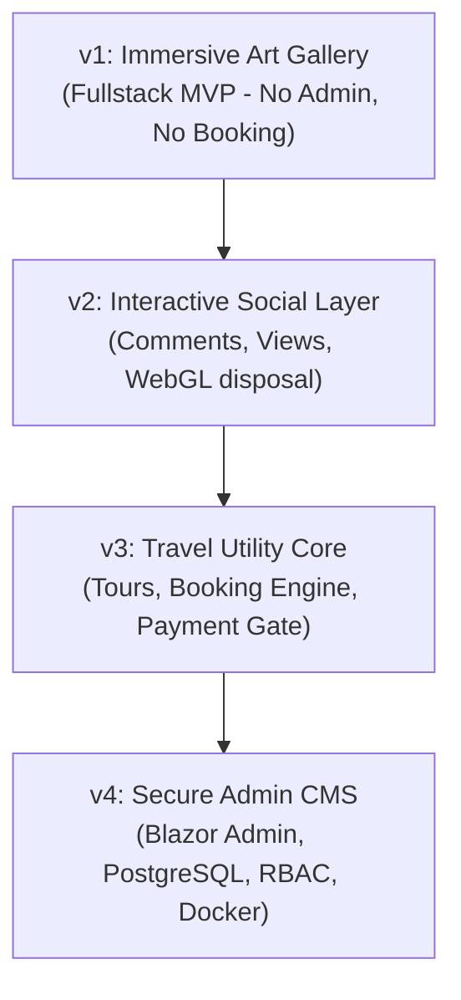
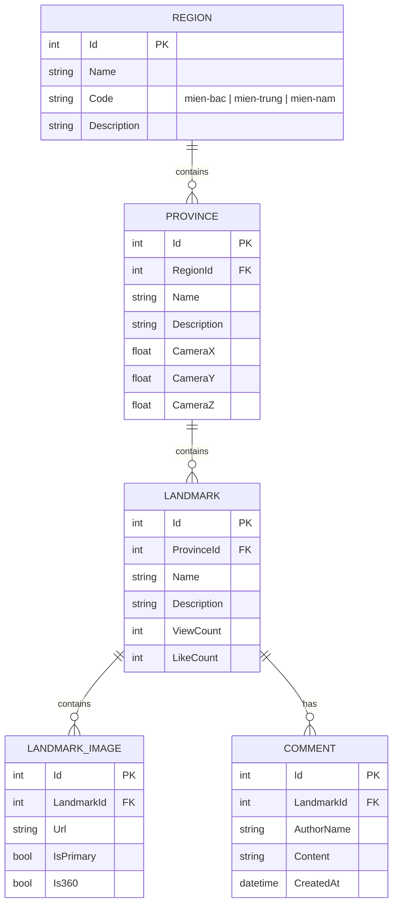

# 🏛️ Technical Blueprint: Immersive 3D Vietnam Travel Map

Tài liệu này tổng hợp toàn bộ các kết luận, phân tích thiết kế và định hướng kiến trúc từ các buổi thảo luận (Sessions 15, 16, 17, 18, 21, 22, 23, 24, 25, 26, 27, 28) về dự án **Website Bản đồ Du lịch Việt Nam Tương tác 3D**. Đây là tài liệu thiết kế hệ thống (System Design Blueprint) chính thức làm kim chỉ nam cho quá trình triển khai dự án.

---

## 👁️ 1. Tầm Nhìn & Phạm Vi Sản Phẩm (Project Vision & Scope)

### 🎯 Tầm nhìn cốt lõi
*   **Định vị sản phẩm**: Một **Triển lãm nghệ thuật số (Digital Art Exhibition)** hướng tới trải nghiệm thị giác và cảm xúc khám phá hơn là một công cụ bản đồ GIS tra cứu thông tin hành chính.
*   **Yếu tố WOW**: Sử dụng phong cách thiết kế Blueprint Hologram kết hợp với các thẻ ảnh nổi lơ lửng động (Dynamic Holographic Photo Cards) để tạo ấn tượng thị giác cao cấp, tối giản và mang tính tương lai.
*   **Mục tiêu cá nhân**: Tạo dựng một **WOW Portfolio** toàn diện, tích hợp cả Frontend đồ họa mượt mà (Nuxt 3, TresJS) và Backend API chuẩn mực (ASP.NET Core Web API, Clean Architecture), chứng minh năng lực thực tế trong bối cảnh học tập C#/.NET thuộc `STABILIZATION_MODE`.

### 🛡️ Phạm vi kiểm soát (Scope Boundary)
*   **In-Scope (v1)**: Triển lãm bản đồ du lịch 3D 3 miền Việt Nam, xem thông tin tỉnh thành và landmark, xem ảnh nổi lơ lửng, đếm lượt xem địa danh. Hoạt động fullstack (FE gọi BE API, DB SQLite).
*   **Out-of-Scope (v1 - Trì hoãn sang các pha sau)**: Tính năng đặt vé/tour/khách sạn, hệ thống thanh toán, đăng ký tài khoản (Auth) cho khách du lịch, và Trang quản trị (Admin Dashboard/CMS).

---

## 🏛️ 2. Kiến Trúc Hệ Thống & Stack Công Nghệ (System Architecture)

### 🌐 Sơ đồ kiến trúc tổng thể (Decoupled & Static-First)
```
[ Trình duyệt Người dùng (Client Browser) ]
       │
       ├─► (HTTPS / Tải trang tĩnh) ──► [ Vercel / Netlify ] (Hosting FE tĩnh - SSG)
       │
       ├─► (Tải Assets 3D & Ảnh)     ──► [ Cloudflare CDN & Object Storage R2 ] (Asset Store - $0 Egress fee)
       │
       └─► (Gọi JSON REST APIs)      ──► [ Nginx Reverse Proxy / SSL ] (Trên Linux VPS)
                                                 │
                                                 ▼
                                        [ Docker Container ]
                                                 │
                                                 ▼
                                      [ ASP.NET Core Web API ] (Clean Architecture)
                                                 │
                                                 ▼
                                      [ Database: SQLite ] (v1-v3) ──► PostgreSQL (v4)
```

### 💻 Chi tiết Stack công nghệ lựa chọn

| Tầng (Layer) | Công nghệ | Vai trò & Lý do lựa chọn |
| :--- | :--- | :--- |
| **Frontend Framework** | **Nuxt 3 (Vue 3) + TypeScript** | Hỗ trợ Static Site Generation (SSG) tối ưu SEO tuyệt đối cho các công cụ tìm kiếm, bảo mật, tải trang tức thì và host miễn phí. |
| **3D Rendering** | **TresJS (Three.js cho Vue 3)** | Cho phép viết mã Three.js/WebGL dưới dạng component Vue khai báo (declarative) gọn gàng. Sử dụng `<ClientOnly>` để cô lập với quá trình render server. |
| **Animation Engine** | **GSAP (GreenSock)** | Xử lý chuyển động camera 3D mượt mà và các hiệu ứng chuyển tiếp UI lồng ghép. |
| **Asset Pipeline** | **Spline / Blender / Draco** | Dựng bản đồ Blueprint 3D cách điệu 3 miền, nén mô hình GLB bằng Draco để giảm dung lượng file xuống cực thấp (<100KB). |
| **Backend Core** | **ASP.NET Core 8/9 Web API** | Hiệu năng hàng đầu (Kestrel), type-safe, dễ viết Unit Test. Triển khai theo cấu trúc Clean Architecture 4 layer. |
| **Database** | **SQLite (EF Core / Dapper)** | Tinh gọn, không tốn tài nguyên quản trị máy chủ database trong giai đoạn MVP. Dễ dàng chuyển sang PostgreSQL ở v4 chỉ bằng cấu hình Connection String. |
| **Asset Storage** | **Cloudflare R2** | Lưu trữ các tệp GLB 3D và ảnh Panorama 360 độ. **Miễn phí 100% chi phí Egress** giúp tiết kiệm chi phí vận hành. |

---

## 🎨 3. Thiết Kế Trải Nghiệm Người Dùng (UX & Graphic Design)

### 🔹 Phong cách Blueprint Hologram
*   **Trang chủ (Level 1)**: Bản đồ Việt Nam cách điệu 3 miền lớn (Bắc, Trung, Nam) dạng khung dây neon wireframe màu xanh cyan phát sáng nổi trên một lưới tọa độ kỹ thuật 3D tông tối (Dark Theme).
*   **Cấp Miền (Level 2)**: Khi click vào 1 miền, camera 3D zoom cận cảnh vào miền đó, các miền khác mờ đi (fade out). UI 2D (Vue/Tailwind) trượt từ cạnh màn hình ra để hiển thị danh sách các tỉnh/thành tiêu biểu.
*   **Cấp Tỉnh & Địa danh (Level 3 - 4)**: Khi chọn tỉnh/thành, hiển thị danh thắng tương ứng. Tải các **Thẻ ảnh lập thể động (Dynamic Holographic Photo Cards)** dạng plane mesh lơ lửng trong không gian WebGL xung quanh vị trí bản đồ.
*   **Cấp Chi tiết (Level 5)**: Click vào địa danh mở màn hình VR 360 Panorama (dùng Pannellum hoặc Three.js sphere projection) cho phép người dùng nhập vai ngắm nhìn địa điểm thực tế.

### ⚠️ Quy tắc tối ưu hóa WebGL trên Web
1.  **Dọn dẹp bộ nhớ (WebGL Context Disposal)**: Khi chuyển miền hoặc ẩn cấu trúc 3D cũ, bắt buộc viết hàm `dispose()` để giải phóng GPU RAM (geometries, materials, textures) nhằm tránh tràn bộ nhớ gây crash trình duyệt điện thoại.
2.  **Khóa Orbit Controls**: Tránh cho phép người dùng quay tự do vô hạn trên thiết bị di động vì dễ bị loạn hướng nhìn. Chỉ cho phép click chọn trực tiếp và điều hướng camera thông qua tọa độ định nghĩa trước kết hợp GSAP.

---

## 🚀 4. Lộ Trình Phát Triển Phân Kỳ (Iterative Evolution Roadmap)

Lộ trình được chia làm 4 pha giúp cô lập độ phức tạp kỹ thuật, tối ưu hóa thời gian phát triển cho một Solo Developer:



### 📌 v1: Immersive Digital Art Gallery (Fullstack MVP)
*   **Mục tiêu**: Hoàn thành sản phẩm triển lãm bản đồ 3D Việt Nam hoạt động văn phòng fullstack hoàn chỉnh.
*   **Nghiệp vụ**: Xem bản đồ 3D 3 miền, chọn tỉnh, xem địa danh, đọc thông tin và xem ảnh nổi.
*   **Backend**: API Clean Architecture serving dữ liệu tĩnh từ SQLite (được seed sẵn qua code). Chưa có Auth, chưa có admin panel.

### 📌 v2: Interactive Social Layer & Graphic Optimization
*   **Mục tiêu**: Nâng cấp tính năng tương tác của người dùng cuối và tối ưu hiệu năng WebGL.
*   **Nghiệp vụ**: Tự động tăng lượt xem địa danh, viết bình luận ẩn danh (rate-limited), like/thả tim địa danh, bộ lọc tìm kiếm 2D.
*   **Đồ họa**: Chia nhỏ GLB thành 4 file nạp động (lazy loading) và viết hàm hủy tài nguyên GPU (`dispose()`).

### 📌 v3: Travel Utility & Commercial Core (Booking & Payment)
*   **Mục tiêu**: Thương mại hóa sản phẩm, biến triển lãm thành ứng dụng đặt dịch vụ du lịch.
*   **Nghiệp vụ**: Hiển thị danh sách khách sạn, homestay, tour guide. Xây dựng giỏ đặt chỗ (Booking Engine) và Mock Payment (VNPAY/Momo sandbox).
*   **Bảo mật**: Triển khai JWT Authentication cho khách hàng lưu lịch sử.

### 📌 v4: Secure Admin CMS Panel & Enterprise Operations
*   **Mục tiêu**: Hoàn thiện toàn bộ hệ thống quản trị, bảo mật chặt chẽ và tự động hóa vận hành.
*   **Nghiệp vụ**: Xây dựng Admin Dashboard bằng Blazor Server hoặc Vue độc lập để quản trị địa danh, duyệt bình luận, quản lý đơn hàng đặt tour.
*   **Kiến trúc & DevOps**: Phân quyền hệ thống (RBAC), chuyển sang database PostgreSQL, đóng gói Docker Compose toàn cụm (Nginx, FE, BE, DB), và viết CI/CD tự động cập nhật hệ thống.

---

## 🗄️ 5. Định Nghĩa Cấu Trúc Dữ Liệu Lõi (Core Data Schema v1)

Để v1 nâng cấp lên v2-v4 mượt mà, cấu trúc dữ liệu SQLite và API Contract được thiết kế chuẩn hóa theo mô hình quan hệ từ đầu:

### 📊 Thực thể Cơ sở dữ liệu (Database Entities)


### 🔌 API Contracts (Mẫu JSON đầu ra của Backend)
Mẫu JSON phản hồi danh sách Landmark thuộc Tỉnh/Thành phố (`GET /api/provinces/{id}/landmarks`):
```json
[
  {
    "id": 101,
    "provinceId": 5,
    "name": "Vịnh Hạ Long",
    "description": "Di sản thiên nhiên thế giới UNESCO với hàng ngàn đảo đá vôi kỳ vĩ.",
    "viewCount": 1420,
    "likeCount": 350,
    "images": [
      {
        "id": 1,
        "url": "https://cdn.travel3d.vn/models/ha_long_primary.webp",
        "isPrimary": true,
        "is360": false
      },
      {
        "id": 2,
        "url": "https://cdn.travel3d.vn/panoramas/ha_long_360.webp",
        "isPrimary": false,
        "is360": true
      }
    ]
  }
]
```

---

## ⚖️ 6. Cam Kết & Ràng Buộc Kỹ Thuật (Architecture Decision Record - ADR)
1.  **Chấp nhận nợ kỹ thuật ở SQLite**: SQLite không chịu tải tốt với concurrency ghi lớn. Tuy nhiên, do v1 và v2 chủ yếu là tác vụ đọc (Read-Heavy), SQLite được phê duyệt để loại bỏ chi phí quản trị VPS cơ sở dữ liệu.
2.  **Khóa cứng API Contract**: Mọi sửa đổi trên JSON contract ở Frontend v1 phải được cập nhật đồng thời ở C# DTO Classes ở Backend v1 để bảo vệ tính nhất quán của kiến trúc tách rời (Decoupled Architecture).
3.  **Tôn trọng Curfew & Stabilization Mode**: Quá trình phát triển dự án này không được làm ảnh hưởng đến thời gian học tập lõi (Laravel/C# internals) và giờ giới nghiêm tắt màn hình (21:30) của LifeOS.
