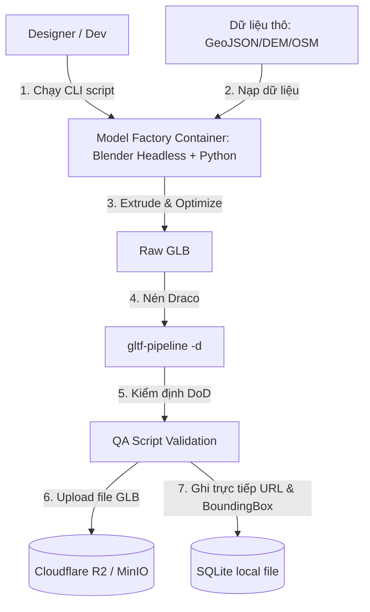

# TS-004: Hệ Thống Bản Đồ 3D Tự Động (Blueprint Map System)

> **Mã số**: TS-004
> **Quy trình**: Spec-Driven Development v3.0
> **Được chuẩn hóa từ**: Decoupled Offline Model Factory Blueprint
> **Tác giả**: SA Agent
> **Ngày cập nhật**: 2026-06-12

---

## 1. Sơ Đồ Kiến Trúc Hệ Thống (Decoupled Data Flow)
Hệ thống được thiết kế tách biệt hoàn toàn giữa **Quy trình sản xuất 3D tĩnh (Offline Asset Generation)** của Designer/Dev và **Quy trình phân phối động (Runtime Client-Server)** trên máy chủ Production.

### Quy trình 1: Sản xuất mô hình và Seeding dữ liệu (Offline - Designer/Dev)


### Quy trình 2: Tải và Render bản đồ (Runtime - Client/Server)
```mermaid
graph LR
    Client[Nuxt 3 / TresJS Client] -->|1. Gọi API hỏi metadata & URL| API[.NET Core Web API]
    API -->|2. Đọc dữ liệu tĩnh cực nhanh| DB[(SQLite Database)]
    API -->> Client|3. Trả về JSON chứa URL GLB & Bounding Box|
    Client -->|4. Lazy-load GLB trực tiếp| Storage[(Cloudflare R2 CDN)]
```

> [!NOTE]
> Lập trình API Backend (.NET Core) trên Production sẽ **không cài đặt Blender Headless và không gọi bất kỳ CLI process nào ở runtime**. Máy chủ Web chỉ chịu trách nhiệm đọc dữ liệu tĩnh từ SQLite và trả về siêu dữ liệu (metadata).

---

## 2. Thiết Kế Cơ Sở Dữ Liệu & Backend Services

### 2.1. Cấu trúc CSDL SQLite (SQLite Schema)
```sql
-- Cập nhật bảng Provinces (Bản đồ cấp Tỉnh)
ALTER TABLE Provinces ADD COLUMN CenterLat REAL;
ALTER TABLE Provinces ADD COLUMN CenterLng REAL;
ALTER TABLE Provinces ADD COLUMN BoundingBox TEXT; -- Định dạng JSON: [minLat, minLng, maxLat, maxLng]
ALTER TABLE Provinces ADD COLUMN Model3DUrl TEXT;   -- URL dẫn tới file GLB trên MinIO/R2

-- Cập nhật bảng Landmarks (Bản đồ địa danh)
ALTER TABLE Landmarks ADD COLUMN Model3DUrl TEXT;   -- URL dẫn tới mô hình Landmark chi tiết
ALTER TABLE Landmarks ADD COLUMN Scale REAL DEFAULT 1.0;
ALTER TABLE Landmarks ADD COLUMN RotationY REAL DEFAULT 0.0;
```

### 2.2. Lớp Dịch Vụ API Phục Vụ Metadata (Read-Only Service)
```csharp
public interface IProvinceMetadataService
{
    Task<IEnumerable<ProvinceDto>> GetAllProvincesAsync();
    Task<ProvinceDto> GetProvinceByCodeAsync(string code);
}

public class ProvinceMetadataService : IProvinceMetadataService
{
    private readonly ApplicationDbContext _context;

    public ProvinceMetadataService(ApplicationDbContext context)
    {
        _context = context;
    }

    public async Task<IEnumerable<ProvinceDto>> GetAllProvincesAsync()
    {
        return await _context.Provinces
            .AsNoTracking() // Triệt tiêu theo dõi thay đổi để tối đa hóa tốc độ đọc
            .Select(p => new ProvinceDto
            {
                Code = p.ProvinceCode,
                Name = p.ProvinceName,
                CenterLat = p.CenterLat,
                CenterLng = p.CenterLng,
                BoundingBox = p.BoundingBox,
                Model3DUrl = p.Model3DUrl
            })
            .ToListAsync();
    }
}
```

---

## 3. Công Cụ Tạo Mô Hình Tiện Ích (Standalone Model Factory)
Script chạy offline nạp GeoJSON, đùn 3D tỉnh, và tự động ghi đè thông tin trực tiếp vào tệp SQLite cục bộ của dự án sau khi hoàn thành:

```python
import sys
import os
import json
import sqlite3
import bpy

SCALE_FACTOR = 2.5
CENTER_LON = 108.0
CENTER_LAT = 16.0

def geo_to_webgl(lon, lat):
    return (lon - CENTER_LON) * SCALE_FACTOR, (lat - CENTER_LAT) * SCALE_FACTOR

def generate_province_3d(geojson_path, output_glb_path, db_path, depth=0.5):
    # Khởi tạo Blender trống
    bpy.ops.wm.read_factory_settings(use_empty=True)
    
    with open(geojson_path, 'r', encoding='utf-8') as f:
        data = json.load(f)
        
    code = data["properties"]["code"]
    name = data["properties"]["name"]
    center_lat = data["properties"]["center_lat"]
    center_lng = data["properties"]["center_lng"]
    bbox = json.dumps(data["properties"]["bbox"])
    
    # Tạo hình hình học từ tọa độ GeoJSON
    curve_data = bpy.data.curves.new(name=f"Curve_{code}", type='CURVE')
    curve_data.dimensions = '2D'
    
    polygons = data["geometry"]["coordinates"]
    for poly in polygons:
        coords = poly[0] if isinstance(poly[0][0], list) else poly
        if len(coords) < 3: continue
        
        spline = curve_data.splines.new('POLY')
        spline.points.add(len(coords) - 1)
        for idx, pt in enumerate(coords):
            x, y = geo_to_webgl(pt[0], pt[1])
            spline.points[idx].co = (x, y, 0.0, 1.0)
        spline.use_cyclic_u = True

    curve_obj = bpy.data.objects.new(f"province_{code}", curve_obj)
    bpy.context.scene.collection.objects.link(curve_obj)
    
    curve_data.extrude = depth / 2.0
    curve_data.bevel_depth = 0.02
    
    # Convert to Mesh & Export GLB
    bpy.context.view_layer.objects.active = curve_obj
    bpy.ops.object.convert(target='MESH')
    
    bpy.ops.export_scene.gltf(filepath=output_glb_path, export_format='GLB', use_selection=True)
    
    # --- ĐỒNG BỘ DỮ LIỆU VÀO SQLITE LOCAL ---
    conn = sqlite3.connect(db_path)
    cursor = conn.cursor()
    cdn_url = f"https://cdn.vietnamtravel3d.com/models/provinces/province_{code}.glb"
    
    cursor.execute("""
        UPDATE Provinces 
        SET CenterLat = ?, CenterLng = ?, BoundingBox = ?, Model3DUrl = ?
        WHERE ProvinceCode = ?
    """, (center_lat, center_lng, bbox, cdn_url, code))
    
    conn.commit()
    conn.close()
```
