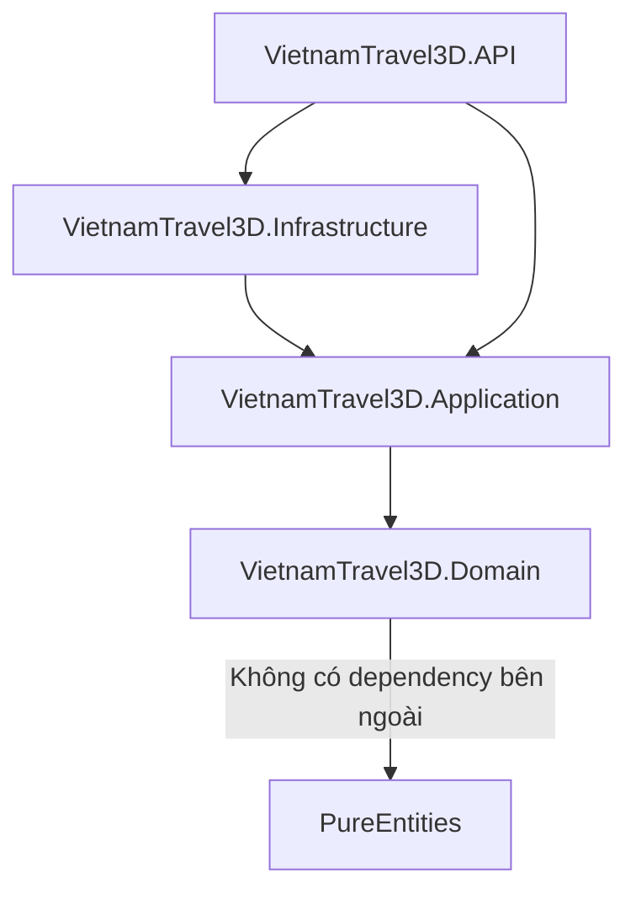

# 📚 Kiến Thức Kiến Trúc & Kỹ Thuật Cần Chú Ý (VietnamTravel3D)

Tài liệu này tổng hợp toàn bộ các lưu ý quan trọng về mặt kiến trúc, thiết kế, tối ưu hóa cơ sở dữ liệu và xử lý kỹ thuật trong dự án **VietnamTravel3D** để các thành viên phát triển có thể nắm bắt và áp dụng thống nhất.

---

## 🏛️ 1. Phân Tách Lớp & Ranh Giới Kiến Trúc (Clean Architecture)

Dự án tuân thủ nghiêm ngặt mô hình **Clean Architecture**:



### Các lưu ý cốt lõi:
*   **Domain**: Chứa các thực thể lõi (`Region`, `Province`, `Landmark`, `LandmarkImage`) và Value Objects (`CameraPosition`). Tuyệt đối không phụ thuộc vào EF Core hay bất kỳ thư viện bên ngoài nào.
*   **Application**: Định nghĩa Interface truy xuất dữ liệu (`IApplicationDbContext`), các DTOs (`ProvinceDto`, `RegionDto`...) và triển khai Service Pattern (`RegionService`, `ProvinceService`...). Dữ liệu đi ra ngoài API bắt buộc phải thông qua DTO để làm phẳng cấu trúc dữ liệu phức tạp và bảo vệ thực thể Domain.
*   **Infrastructure**: Chứa cấu hình EF Core cụ thể, cấu hình bảng qua Fluent API, các Migration và dữ liệu Seeding.
*   **API**: Chỉ chịu trách nhiệm tiếp nhận HTTP Requests, cấu hình Middleware (như Output Cache, Scalar UI), định tuyến và điều phối các Services từ tầng Application.

---

## 💾 2. Tối Ưu Hóa EF Core Cho Hệ Thống Đọc Nhiều (Read-Heavy)

Dựa trên nhận định hệ thống chủ yếu thực hiện các truy vấn đọc bản đồ và thông tin địa danh (đọc nhiều hơn ghi rất nhiều lần), chúng ta áp dụng các cấu hình tối ưu hóa sau:

### A. Tắt Tính Năng Change Tracking Mặc Định
Trong [DependencyInjection.cs](file:///c:/source/personal/VietnamTravel3D/VietnamTravel3D/VietnamTravel3D.Infrastructure/DependencyInjection.cs) của lớp Infrastructure:
```csharp
builder.Services.AddDbContext<ApplicationDbContext>(options =>
{
    options.UseSqlite(connectionString)
           .UseQueryTrackingBehavior(QueryTrackingBehavior.NoTracking); // <-- Tối ưu hóa cốt lõi
});
```
> [!NOTE]
> Bằng cách cấu hình mặc định là `NoTracking`, EF Core sẽ bỏ qua việc theo dõi các thay đổi của thực thể trong bộ nhớ RAM, giúp giảm đáng kể thời gian truy vấn (tới 30-50%) và tiết kiệm bộ nhớ.
> Nếu sau này cần viết API có lưu/cập nhật dữ liệu, ta cần sử dụng `.AsTracking()` tường minh trong câu truy vấn cụ thể hoặc gọi `.Update()` trên DbContext.

### B. Chỉ Mục Cơ Sở Dữ Liệu (Indexes)
Tất cả các trường dùng để tìm kiếm, sắp xếp hoặc liên kết khóa ngoại đều được cấu hình Index rõ ràng qua Fluent API:
*   `Region`: Tạo Index cho `Name`, Unique Index cho `Code` (dùng để tra cứu nhanh theo mã miền).
*   `Province`: Tạo Index cho `Name`.
*   `Landmark`: Tạo Index cho `Name`.

### C. SQLite Connection String (Shared Cache & WAL)
Chuỗi kết nối trong [appsettings.json](file:///c:/source/personal/VietnamTravel3D/VietnamTravel3D/VietnamTravel3D.API/appsettings.json) được cấu hình:
```json
"DefaultConnection": "Data Source=vietnam_travel.db;Cache=Shared;"
```
*   `Cache=Shared` cho phép nhiều kết nối đọc dùng chung vùng cache bộ nhớ của SQLite, nâng cao tốc độ phản hồi đồng thời giữa các luồng.

---

## 🛠️ 3. Ánh Xạ Kiểu Dữ Liệu Phức Tạp (Complex Types trong EF Core)

Tọa độ Camera của mỗi Tỉnh/Thành phố được biểu diễn bằng một Value Object:
```csharp
public readonly record struct CameraPosition
{
    public float X { get; init; }
    public float Y { get; init; }
    public float Z { get; init; }
}
```

EF Core 8/9/10 hỗ trợ **Complex Types** (thay thế cho `Owned Types` trước đây) cho phép ánh xạ trực tiếp đối tượng này vào cùng một bảng `Provinces` mà không cần tách bảng hoặc dùng chuỗi JSON phức tạp.
Cấu hình Fluent API tại [ProvinceConfiguration.cs](file:///c:/source/personal/VietnamTravel3D/VietnamTravel3D/VietnamTravel3D.Infrastructure/Persistence/Configurations/ProvinceConfiguration.cs):
```csharp
builder.ComplexProperty(p => p.CameraPosition, cp =>
{
    cp.Property(c => c.X).HasColumnName("CameraX");
    cp.Property(c => c.Y).HasColumnName("CameraY");
    cp.Property(c => c.Z).HasColumnName("CameraZ");
});
```

### 📋 Quy Tắc Định Nghĩa Tên Cột Cho Complex Types:

Tên cột của một Complex Type trong DB được xác định dựa theo 3 mức ưu tiên (từ thấp đến cao) như sau:

1. **Mặc định (Default Naming Convention)**:
   Nếu không cấu hình gì thêm, EF Core sẽ đặt tên cột bằng cách kết hợp:
   `[Tên_Thuộc_Tính_Cha]_[Tên_Thuộc_Tính_Con]`
   *Ví dụ:* Với thuộc tính `CameraPosition CameraPosition` có các trường `X, Y, Z`, tên cột mặc định trong bảng `Provinces` sẽ là:
   * `CameraPosition_X`
   * `CameraPosition_Y`
   * `CameraPosition_Z`
   *Lưu ý:* Nếu có lồng nhau nhiều cấp, EF Core sẽ tiếp tục nối chuỗi tên dạng: `Cha_Con_Chau`.

2. **Sử dụng Data Annotations (Trong thực thể Domain)**:
   Bạn có thể định nghĩa trực tiếp trên các thuộc tính của struct/class bằng attribute `[Column]`:
   ```csharp
   public readonly record struct CameraPosition
   {
       [Column("CameraX")]
       public float X { get; init; }
   }
   ```
   *Đặc điểm:* Cách này ghi đè lên cấu hình mặc định, tuy nhiên **không khuyên dùng** trong kiến trúc Clean Architecture vì nó đưa các dependency liên quan tới Persistence (EF Core) trực tiếp vào lớp Domain lõi.

3. **Sử dụng Fluent API (Khuyên dùng - Đang áp dụng)**:
   Ghi đè bằng cấu hình Fluent API trong lớp Configuration thuộc Infrastructure:
   ```csharp
   builder.ComplexProperty(p => p.CameraPosition, cp =>
   {
       cp.Property(c => c.X).HasColumnName("CameraX"); // Chỉ định tên cột rõ ràng
   });
   ```
   *Đặc điểm:* Có mức ưu tiên cao nhất, giữ cho Domain entities hoàn toàn "sạch" (Pure C#), đồng thời giúp kiểm soát cấu trúc bảng cơ sở dữ liệu một cách độc lập với việc đặt tên biến C# (ví dụ khi refactor tên biến `X` thành `Longitude` thì cấu trúc cột DB `CameraX` vẫn không bị thay đổi).

---

## 🌐 4. Xử Lý Tiếng Việt (Encoding) & Phép Ánh Xạ JSON Khi Seeding

Khi thực hiện import dữ liệu 63 Tỉnh/Thành từ file JSON nhúng tĩnh [vietnam_provinces.json](file:///c:/source/personal/VietnamTravel3D/VietnamTravel3D/VietnamTravel3D.Infrastructure/Persistence/Seeds/vietnam_provinces.json):

### A. Lỗi Font Tiếng Việt (Mojibake)
Trên Windows, nếu đọc Stream của embedded resource mà không chỉ định Encoding, mặc định hệ thống sẽ dùng trang mã ANSI của hệ điều hành, dẫn đến lỗi ký tự tiếng Việt có dấu.
*   **Giải pháp**: Bắt buộc chỉ định `Encoding.UTF8` khi khởi tạo `StreamReader` trong [ApplicationDbContextSeed.cs](file:///c:/source/personal/VietnamTravel3D/VietnamTravel3D/VietnamTravel3D.Infrastructure/Persistence/Seeds/ApplicationDbContextSeed.cs).
```csharp
using var reader = new StreamReader(stream, Encoding.UTF8);
```

### B. Ánh Xạ Ràng Buộc Thuộc Tính JSON
Thư viện `System.Text.Json` phân biệt chữ hoa/chữ thường và không tự động bỏ dấu gạch dưới (snake_case) khi ánh xạ vào thuộc tính PascalCase của C# nếu không được cấu hình.
*   **Giải pháp**: Sử dụng attribute `[JsonPropertyName]` cho các thuộc tính đặc thù trong DTO Seeding (ví dụ: `phone_code` -> `PhoneCode`, `division_type` -> `DivisionType`) để tránh dữ liệu bị `null` hoặc lấy giá trị mặc định.

---

## 🚀 5. Chiến Lược Lưu Bộ Nhớ Đệm (Output Caching)

Vì dữ liệu địa danh và tỉnh thành của Việt Nam rất ít khi thay đổi, chúng ta sử dụng **Output Caching** của ASP.NET Core để cache phản hồi API trực tiếp tại tầng HTTP phản hồi.

### Cấu hình trong Program.cs:
```csharp
builder.Services.AddOutputCache();
...
app.UseOutputCache();
```

### Cấu hình tại Controller:
```csharp
[HttpGet]
[OutputCache(Duration = 86400)] // Cache 24 giờ
public async Task<ActionResult<IEnumerable<RegionDto>>> GetRegions()
```

> [!WARNING]
> Đối với các API có tham số đường dẫn (ví dụ: `GET /api/regions/{id}/provinces`), nếu chỉ đặt `[OutputCache]` thông thường, hệ thống sẽ trả về cùng một kết quả cho mọi `id`.
> Ta bắt buộc phải cấu hình `VaryByRouteValueNames` để chỉ định cache phân biệt theo tham số định tuyến:
> ```csharp
> [HttpGet("{id:int}/provinces")]
> [OutputCache(Duration = 86400, VaryByRouteValueNames = ["id"])]
> public async Task<ActionResult<IEnumerable<ProvinceDto>>> GetProvinces(int id)
> ```

---

## 🎨 6. Tài Liệu API Hiện Đại Với OpenAPI & Scalar UI

Kể từ .NET 9, thư viện mặc định được khuyên dùng để tạo đặc tả OpenAPI là `Microsoft.AspNetCore.OpenApi` thay thế cho Swashbuckle cũ. 

*   Đặc tả JSON thô được cung cấp tại đường dẫn `/openapi/v1.json`.
*   Để có giao diện kiểm thử đẹp và trực quan, chúng ta tích hợp thêm thư viện **Scalar** (`Scalar.AspNetCore`).
*   Scalar cung cấp giao diện tài liệu API hiện đại, hỗ trợ nhiều ngôn ngữ Client Code Generation trực quan hơn Swagger UI.
*   Đường dẫn kiểm thử: **`/scalar/v1`**.

---

## 🔌 7. Cấu Hình CORS Cho Kết Nối Frontend (Nuxt)

Để đảm bảo ứng dụng Frontend chạy Nuxt 4 (thường mặc định ở cổng `3000`) có thể giao tiếp không gặp lỗi Cross-Origin Resource Sharing (CORS) với ứng dụng API Backend:

### A. Đăng ký dịch vụ CORS trong Program.cs:
```csharp
builder.Services.AddCors(options =>
{
    options.AddPolicy("AllowNuxtApp", policy =>
    {
        policy.WithOrigins("http://localhost:3000", "https://localhost:3000")
              .AllowAnyHeader()
              .AllowAnyMethod();
    });
});
```

### B. Kích hoạt Middleware:
```csharp
app.UseCors("AllowNuxtApp");
```
> [!IMPORTANT]
> Middleware `UseCors` bắt buộc phải đặt sau `UseHttpsRedirection` và trước `UseAuthorization` để đảm bảo luồng xử lý cors diễn ra trước khi kiểm tra quyền truy cập.
